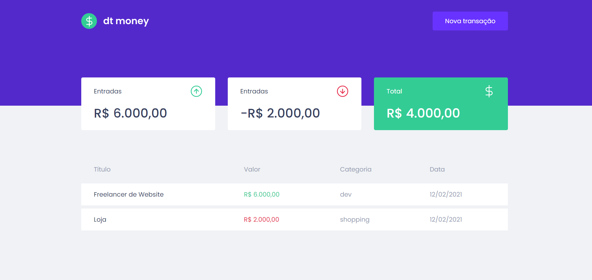
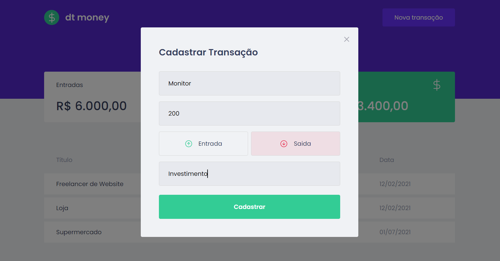

# dt money

<p>
  
  
  
  <a href="https://opensource.org/licenses/MIT">
    
  </a>
  
</p>


## Topics

[Sobre o dt money](#about-moneyapp)

[Tecnologias](#tecnologies)

[Instalação e uso](#installation-and-usage)

[Licence](#license)

<br>

## about money app

money app is a simple and effective alternative to manage your finances, allowing you to register entries, exits and organize them into categories.
<br>

<p align="center">
  
  
</p>

## Tecnologies

Technologies and tools used in project development:

- [React](https://reactjs.org/)
- [TypeScript](https://www.typescriptlang.org/)
- [Styled Components](https://styled-components.com/)
- [MirageJS](https://miragejs.com/)
- [Axios](https://github.com/axios/axios)
- [Polished](https://polished.js.org/)

<br>

## Installation and usage

```bash
# Abra um terminal e copie este repositório com o comando
git clone https://github.com/mohamedstt/moneyapp.git
# ou use a opção de download.

# Entre na pasta web com
cd moneyapp

# Instale as dependências
yarn install

# Rode a aplicação
yarn start
```

<br>

## License

<a href="https://opensource.org/licenses/MIT">
    
</a>

<br>

This project has a MIT license that can be in [LICENSE](/LICENSE) for more details.

---

made with :orange_heart: by [Mohamed Schuster](https://github.com/mohamedstt)

[](https://www.linkedin.com/in/mohamed-schuster/)
[](mailto:mohamedschof@gmail.com)
